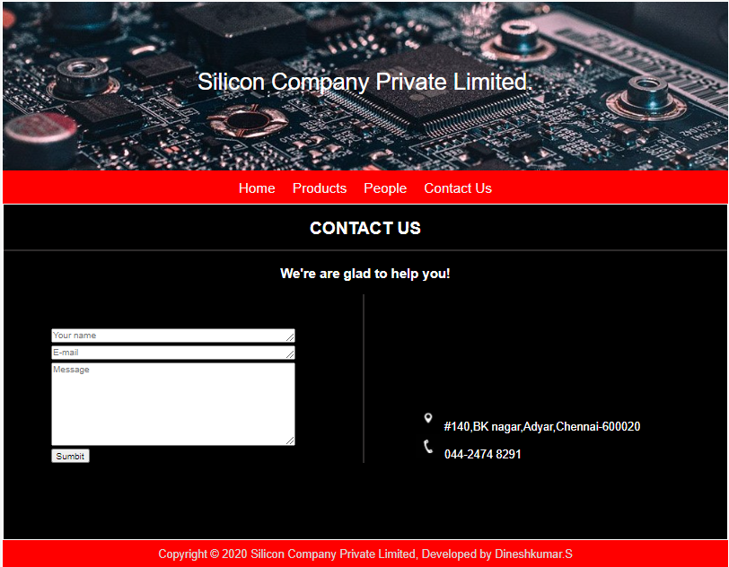

# Web Design for a Manufacturing Company
## AIM: 
To design a static website for a chip manufacturing company.

## DESIGN STEPS:
### Step 1: 
Requirement collection.
### Step 2:
Creating the layout using HTML and CSS.
### Step 3:
Updating the sample content.
### Step 4:
Choose the appropriate style and color scheme.
### Step 5:
Validate the layout in various browsers.
### Step 6:
Validate the HTML code.
### Step 6:
Publish the website in the given URL.

## PROGRAM:

### base.html
```

<!DOCTYPE html>
<html lang="en">

<head>
    <title>Silicon Private Limited</title>
    <link rel="stylesheet" href="">
    <link rel = "icon" href ="" type = "image/x-icon"> 
              
</head>

<body>
    <div class="container">
    <div class="banner">
        Silicon Private Limited.
    </div>
    <div class="menu">
        <div class="menuitem"><a href="/home">Home</a></div> 
        <div class="menuitem"><a href="/products">Products</a></div> 
        <div class="menuitem"><a>People</a></div>
        <div class="menuitem"><a>Contact Us</a></div> 
    </div><div class="content">
        
    
    </div>
    <div class="footer">
        Copyright © 2020 Silicon Private Limited, Developed by Obed Otto.
    </div>
    </div>
</body>

</html>
```

### home.html
```



    <div class="homecontent">    
    <h1>About Us</h1>
    
    <div class="contenttext">
    Silicon Pvt Ltd, provides a broad range of semiconductor and infrastructure software applications. Some of Silicon's core technologies and products include:
    <ul>
        <li>Memory Chips</li>
        <li>SATA HDD</li>
        <li>SATA SSD </li>
        <li>Broadband Modems</li>
        <li>Wifi Devices</li>
        <li>Switching Devices</li>
        <li>Optical Sensors</li>
    </ul> 
    </div>
    </div>

```
### products.html
```



    <div class="productcontent">    
    <h1>Our Premium Products</h1>
    <div class="productitems">
        <div class="productitem"> 
            <div class="itemimage">
            
            </div>
            <div class="itemname">4GB DDRA4 laptop memory</div>
            <div class="itemprice">Price: Rs.2000.00 </div>
        </div>
        <div class="productitem"> 
            <div class="itemimage">
            
            </div>
            <div class="itemname">1TB Laptop HDD</div>
            <div class="itemprice">Price: Rs.5000.00 </div>
        </div>
        <div class="productitem"> 
            <div class="itemimage">
            
            </div>
            <div class="itemname">1TB 665p Series M.2 2280 PCIe NVMe 3.0 x4 3D3, QLC Internal Solid State Drive (SSD)</div>
            <div class="itemprice">Price: Rs.12000.00 </div>
        </div>
        <div class="productitem"> 
            <div class="itemimage">
            
            </div>
            <div class="itemname">2TB 3D NAND NVMe PCIe Internal SSD</div>
            <div class="itemprice">Price: Rs.38000.00 </div>
        </div>
        <div class="productitem"> 
            <div class="itemimage">
            
            </div>
            <div class="itemname">16GB Single DDR4 2666  PC4-21300 DR x8 SODIMM 260-Pin RAM</div>
            <div class="itemprice">Price: Rs.7000.00 </div>
        </div>
        <div class="productitem"> 
            <div class="itemimage">
            
            </div>
            <div class="itemname">8GB DDR4 modules for notebooks 2666 Laptop Memory</div>
            <div class="itemprice">Price: Rs.10000.00 </div>
        </div>
        <div class="productitem"> 
            <div class="itemimage">
            
            </div>
            <div class="itemname">8GB DDR4-2400 PC4-19200 CL-17 SODIMM RAM</div>
            <div class="itemprice">Price: Rs.2800.00 </div>
        </div>
        <div class="productitem"> 
            <div class="itemimage">
            
            </div>
            <div class="itemname">Analog to Digital Breakout Board</div>
            <div class="itemprice">Price: Rs.600.00 </div>
        </div>
        <div class="productitem"> 
            <div class="itemimage">
            
            </div>
            <div class="itemname">ATmega32 Microcontroller</div>
            <div class="itemprice">Price: Rs.100.00 </div>
        </div>
        <div class="productitem"> 
            <div class="itemimage">
            
            </div>
            <div class="itemname">PIC Development Board ZIF Socket with On Board PIC16F877A MAX232</div>
            <div class="itemprice">Price: Rs.900.00 </div>
        </div>
        <div class="productitem"> 
            <div class="itemimage">
            
            </div>
            <div class="itemname">Quick Starter Development Board and AVR USB ISP Programmer Starter Kits</div>
            <div class="itemprice">Price: Rs.1000.00 </div>
        </div>
        <div class="productitem"> 
            <div class="itemimage">
            
            </div>
            <div class="itemname">Infrared (IR) Proximity or Obstacle Detecting Sensor Module</div>
            <div class="itemprice">Price: Rs.100.00 </div>
        </div>
    </div>
    </div>

```
### people.html:
```



    <div class="peoplecontent">
        <div>
            <div class="peopleimg">
                
            </div>
            <div class="peopledetails">
                <h3>Aakash.V.P</h3>
                <h3>B.Tech</h3>
            </div>
        </div>
        <div>
            <div class="peopleimg">
                
            </div>
            <div class="peopledetails">
                <h3>Aishree</h3>
                <h3>B.Tech</h3>
            </div>
        </div>
        <div>
            <div class="peopleimg">
                
            </div>
            <div class="peopledetails">
                <h3>Dineshkumar.S</h3>
                <h3>B.Tech</h3>
            </div>
        </div>
        <div>
            <div class="peopleimg">
                
            </div>
            <div class="peopledetails">
                <h3>Ashwin.A.O</h3>
                <h3>B.Tech</h3>
            </div>
        </div>
         <div>
            <div class="peopleimg">
                
            </div>
            <div class="peopledetails">
                <h3>Graham Stanes</h3>
                <h3>B.Tech</h3>
            </div>
        </div>
         <div>
            <div class="peopleimg">
                
            </div>
            <div class="peopledetails">
                <h3>Sumyuktha Rani</h3>
                <h3>B.Tech</h3>
            </div>
        </div>
    </div>

```
### contactus.html:
```



    <div>
        <h2>CONTACT US</h2>
        <h3 id="h3">We're are glad to help you!</h3>
        <div>
            <form class="complaints" action="/test" method="POST">
                <textarea placeholder="Your name" rows="1" cols="50" name="name" id="name"></textarea><br>  
                <textarea type="text" placeholder="E-mail" rows="1" cols="50" name="email" id="email"></textarea><br>
                <textarea name="message" id="message" rows="8" cols="50" placeholder="Message"></textarea><br>
                <button type="submit" name="submit" id="submit">Sumbit</button>
            </form>
            <div class="contactus">
                <div>
                    
                    <a>#140,BK nagar,Adyar,Chennai-600020</a>
                </div>
                <div>
                    
                    <a>044-2474 8291</a>
                </div>
            </div>
        </div>
    </div>

``` 
## OUTPUT:





## CODE VALIDATION REPORT:


## RESULT:
Thus a website is designed for the chip manufacturing company and is hosted in the URL http://dineshkumars.student.saveetha.in:8000/. HTML code is validated.